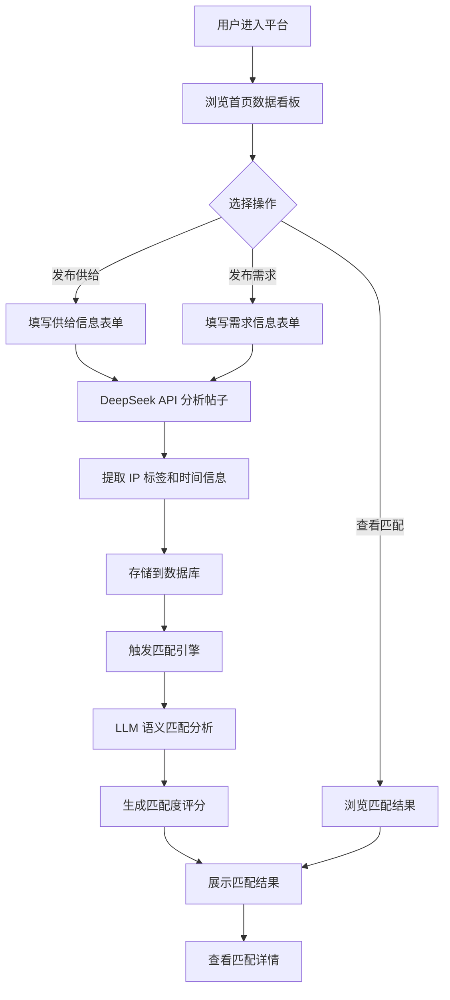

## 1. 产品概述

需求撮合平台是一个基于大语言模型（DeepSeek API）的智能供需匹配系统。用户可以在平台上发布供给信息（我能提供什么）和需求信息（我需要什么），系统通过 LLM 对帖子内容进行深度语义分析，自动提取涉及的知识产权（IP）内容，并结合时间窗口进行智能匹配，帮助用户快速找到合适的合作方。

- **目标用户**：内容创作者、IP 授权方、品牌方、MCN 机构、自由职业者等需要进行资源对接的用户
- **核心价值**：通过 AI 驱动的语义理解替代传统关键词搜索，实现更精准、更高效的供需撮合

## 2. 核心功能

### 2.1 用户角色

| 角色 | 注册方式 | 核心权限 |
|------|----------|----------|
| 普通用户 | 无需注册，即开即用 | 发布供需帖、浏览匹配结果、查看数据看板 |

### 2.2 功能模块

1. **首页数据看板**：平台概览统计、最新供需动态、匹配成功率趋势
2. **供给管理**：供给帖子列表、筛选查看、发布新供给
3. **需求管理**：需求帖子列表、筛选查看、发布新需求
4. **智能匹配**：基于 LLM 的供需匹配引擎、匹配度评分、匹配结果展示
5. **帖子详情**：查看单个供需帖的完整信息，包括 AI 提取的 IP 标签和时间分析

### 2.3 页面详情

| 页面名称 | 模块名称 | 功能描述 |
|----------|----------|----------|
| 首页看板 | 统计卡片 | 展示供给总数、需求总数、匹配成功数、匹配率 |
| 首页看板 | 最新动态 | 时间线展示最近发布的供需帖和匹配结果 |
| 首页看板 | 快速操作 | 一键跳转发布供给/需求 |
| 供给列表 | 筛选栏 | 按 IP 标签、时间范围、状态筛选供给帖 |
| 供给列表 | 供给卡片 | 展示供给摘要、IP 标签、发布时间、匹配状态 |
| 需求列表 | 筛选栏 | 按 IP 标签、时间范围、状态筛选需求帖 |
| 需求列表 | 需求卡片 | 展示需求摘要、IP 标签、发布时间、匹配状态 |
| 发布页面 | 发布表单 | 标题、内容描述、IP 名称、可用时间段、联系方式 |
| 发布页面 | AI 预分析 | 提交后自动调用 DeepSeek API 提取关键信息 |
| 匹配结果 | 匹配列表 | 展示匹配对、匹配度评分、匹配理由 |
| 匹配结果 | 匹配详情 | 展开查看供需双方的完整信息和 AI 分析对比 |
| 帖子详情 | 信息展示 | 完整帖子内容、AI 提取的 IP 标签、时间分析 |
| 帖子详情 | 匹配推荐 | 展示与该帖子匹配的其他帖子 |

## 3. 核心流程

用户进入平台后，在首页可看到整体数据概览。用户可以选择发布供给帖或需求帖，填写标题、内容描述、IP 名称、可用时间窗口等信息。提交后，系统自动调用 DeepSeek API 对帖子内容进行分析，提取 IP 关键词、分析供需类型、解析时间窗口。

当系统中同时存在供给和需求帖子时，匹配引擎会遍历所有未匹配的帖子对，调用 LLM 进行语义匹配分析，计算匹配度评分（0-100）。匹配成功的对会展示在匹配结果页面，用户可以查看详细的匹配理由和对比分析。

## 4. 用户界面设计

### 4.1 设计风格

- **主色调**：深色主题为主，使用深蓝灰（#0f172a）作为背景色，翡翠绿（#10b981）作为主强调色，琥珀橙（#f59e0b）作为辅助强调色
- **按钮风格**：圆角卡片式按钮，带微妙阴影和 hover 发光效果
- **字体**：标题使用 "DM Serif Display" 衬线体，正文使用 "DM Sans" 无衬线体，数字/数据使用 "JetBrains Mono" 等宽字体
- **布局风格**：左侧导航 + 右侧内容区的经典仪表盘布局，卡片采用玻璃拟态（glassmorphism）效果
- **图标风格**：使用 lucide-react 图标库，线条风格

### 4.2 页面设计概览

| 页面名称 | 模块名称 | UI 元素 |
|----------|----------|---------|
| 首页看板 | 统计卡片 | 4 张玻璃拟态卡片并排，每张显示图标 + 数值 + 标签，hover 时上浮 + 发光边框 |
| 首页看板 | 最新动态 | 垂直时间线布局，左侧时间轴，右侧内容卡片，交替左右排列 |
| 首页看板 | 快速操作 | 两个大按钮"发布供给"/"发布需求"，居中排列，带渐变光晕效果 |
| 供给/需求列表 | 筛选栏 | 顶部水平标签式筛选，包含 IP 标签下拉、时间范围选择、状态切换 |
| 供给/需求列表 | 帖子卡片 | 网格布局，卡片含标题、IP 标签胶囊、内容摘要（2行截断）、时间信息、匹配状态徽章 |
| 发布页面 | 发布表单 | 居中单栏布局，大输入框，步骤式引导（标题→内容→IP→时间），底部提交按钮带加载动画 |
| 匹配结果 | 匹配列表 | 垂直列表，每条匹配对显示需求标题 + 供给标题 + 匹配度环形图 + 匹配理由摘要 |
| 匹配结果 | 匹配详情 | 展开面板，左右对比布局：左侧需求详情 vs 右侧供给详情，中间匹配度大数字 |
| 帖子详情 | 信息展示 | 顶部标题 + IP 标签，中间完整内容区，右侧边栏显示 AI 分析结果和时间窗口 |

### 4.3 响应式设计

- 桌面端（>1024px）：左侧固定导航 + 右侧内容区，卡片网格 3 列
- 平板端（768-1024px）：顶部导航 + 全宽内容，卡片网格 2 列
- 移动端（<768px）：底部导航 + 全宽内容，卡片单列堆叠

## 5. 非功能需求

- DeepSeek API 调用需做请求限流，单用户每分钟不超过 10 次
- 匹配引擎采用异步处理，避免阻塞用户操作
- 所有数据本地 SQLite 存储，无需外部依赖
- 帖子内容支持 Markdown 格式输入