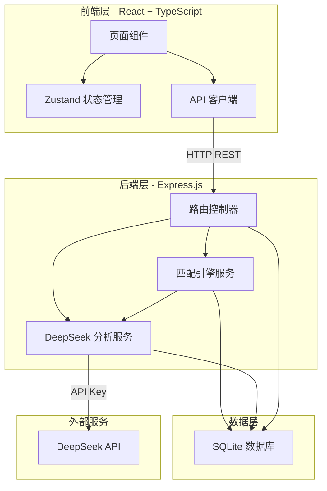
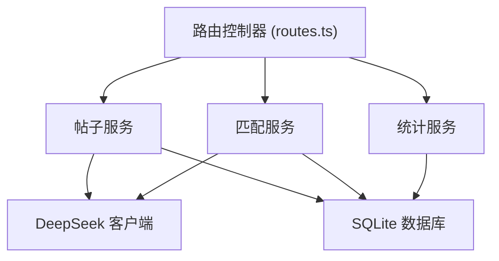
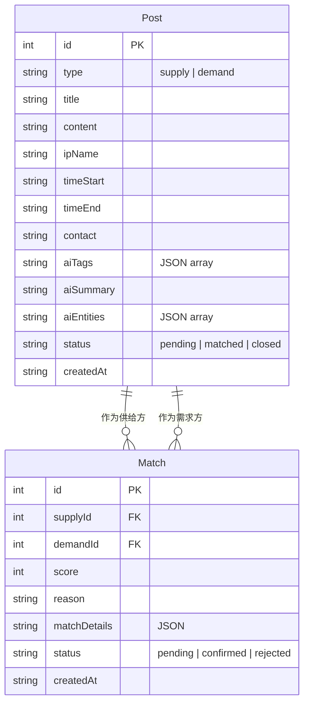

## 1. 架构设计



## 2. 技术选型

- **前端**：React@18 + TypeScript + TailwindCSS@3 + Vite
- **状态管理**：Zustand
- **路由**：React Router DOM v6
- **图标**：lucide-react
- **后端**：Express@4 + TypeScript (ESM)
- **数据库**：SQLite (better-sqlite3)
- **外部 API**：DeepSeek API (deepseek-chat 模型)
- **初始化工具**：vite-init (react-express-ts 模板)

## 3. 路由定义

| 路由 | 页面 | 描述 |
|------|------|------|
| / | 首页看板 | 数据概览、最新动态、快速操作 |
| /supply | 供给列表 | 所有供给帖子浏览与筛选 |
| /demand | 需求列表 | 所有需求帖子浏览与筛选 |
| /publish | 发布页面 | 发布新供给或需求帖 |
| /matches | 匹配结果 | 查看所有匹配结果 |
| /post/:id | 帖子详情 | 查看单个帖子完整信息 |

## 4. API 定义

### 4.1 帖子相关

```typescript
// 发布帖子
POST /api/posts
RequestBody: {
  type: "supply" | "demand";
  title: string;
  content: string;
  ipName: string;
  timeStart: string;   // ISO datetime
  timeEnd: string;     // ISO datetime
  contact: string;
}
Response: {
  id: number;
  type: string;
  title: string;
  content: string;
  ipName: string;
  timeStart: string;
  timeEnd: string;
  contact: string;
  aiTags: string[];        // AI 提取的标签
  aiSummary: string;       // AI 生成的摘要
  aiEntities: string[];    // AI 提取的实体/IP
  status: "pending" | "matched" | "closed";
  createdAt: string;
}

// 获取帖子列表
GET /api/posts?type=supply|demand&status=pending|matched|closed&ipName=xxx
Response: Post[]

// 获取帖子详情
GET /api/posts/:id
Response: Post & { matches: MatchResult[] }
```

### 4.2 匹配相关

```typescript
// 获取匹配结果列表
GET /api/matches
Response: {
  id: number;
  supplyPost: Post;
  demandPost: Post;
  score: number;              // 0-100
  reason: string;             // AI 匹配理由
  matchDetails: {
    ipMatch: number;          // IP 匹配度
    timeMatch: number;        // 时间匹配度
    contentMatch: number;     // 内容匹配度
  };
  status: "pending" | "confirmed" | "rejected";
  createdAt: string;
}[]

// 触发匹配（对指定帖子）
POST /api/matches/run
RequestBody: { postId?: number }
Response: { matched: number; results: MatchResult[] }

// 确认/拒绝匹配
PATCH /api/matches/:id
RequestBody: { status: "confirmed" | "rejected" }
```

### 4.3 分析相关

```typescript
// AI 分析帖子内容
POST /api/analyze
RequestBody: { content: string; title: string }
Response: {
  tags: string[];
  summary: string;
  entities: string[];
  sentiment: "supply" | "demand" | "neutral";
  timeInfo: { start: string; end: string } | null;
}
```

### 4.4 统计相关

```typescript
// 获取首页统计数据
GET /api/stats
Response: {
  totalSupply: number;
  totalDemand: number;
  totalMatched: number;
  matchRate: number;
  recentPosts: Post[];
  recentMatches: MatchResult[];
}
```

## 5. 服务端架构



## 6. 数据模型

### 6.1 ER 图



### 6.2 数据定义语言 (DDL)

```sql
CREATE TABLE posts (
    id INTEGER PRIMARY KEY AUTOINCREMENT,
    type TEXT NOT NULL CHECK(type IN ('supply', 'demand')),
    title TEXT NOT NULL,
    content TEXT NOT NULL,
    ip_name TEXT DEFAULT '',
    time_start TEXT DEFAULT '',
    time_end TEXT DEFAULT '',
    contact TEXT DEFAULT '',
    ai_tags TEXT DEFAULT '[]',
    ai_summary TEXT DEFAULT '',
    ai_entities TEXT DEFAULT '[]',
    status TEXT DEFAULT 'pending' CHECK(status IN ('pending', 'matched', 'closed')),
    created_at TEXT DEFAULT (datetime('now'))
);

CREATE TABLE matches (
    id INTEGER PRIMARY KEY AUTOINCREMENT,
    supply_id INTEGER NOT NULL REFERENCES posts(id),
    demand_id INTEGER NOT NULL REFERENCES posts(id),
    score INTEGER DEFAULT 0,
    reason TEXT DEFAULT '',
    match_details TEXT DEFAULT '{}',
    status TEXT DEFAULT 'pending' CHECK(status IN ('pending', 'confirmed', 'rejected')),
    created_at TEXT DEFAULT (datetime('now'))
);

CREATE INDEX idx_posts_type ON posts(type);
CREATE INDEX idx_posts_status ON posts(status);
CREATE INDEX idx_posts_ip ON posts(ip_name);
CREATE INDEX idx_matches_status ON matches(status);
CREATE INDEX idx_matches_supply ON matches(supply_id);
CREATE INDEX idx_matches_demand ON matches(demand_id);
```